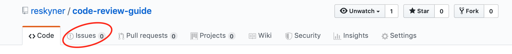
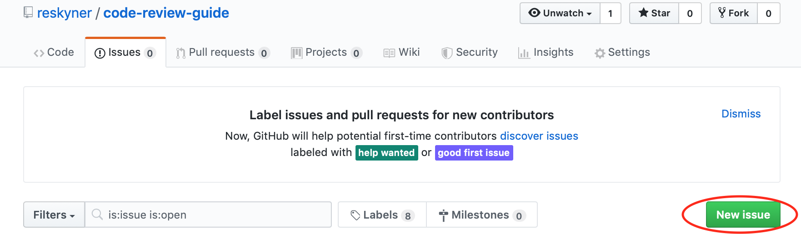
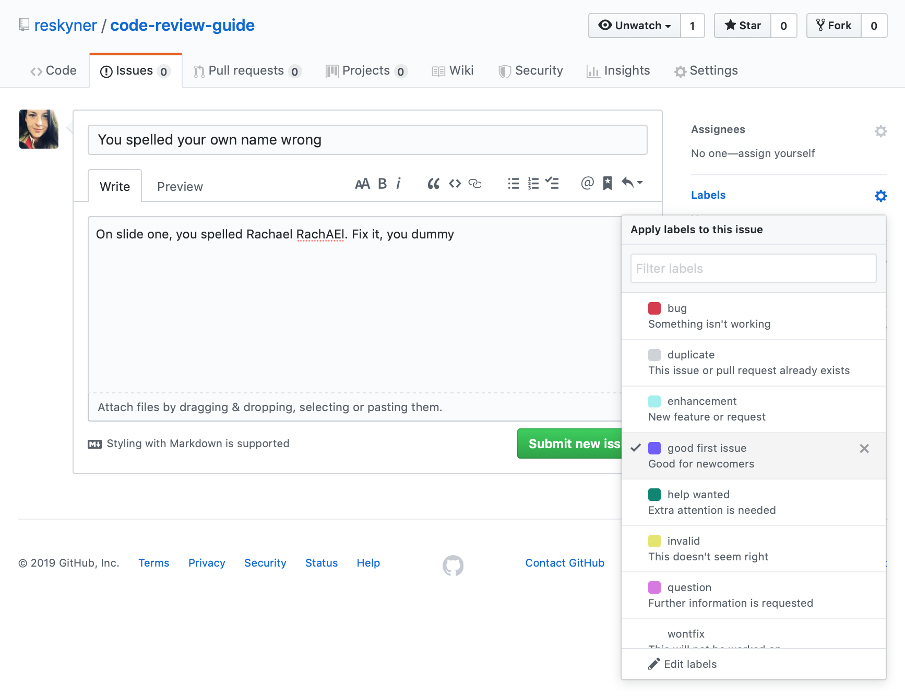
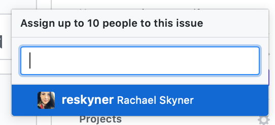

---

# Code Review Guidelines
## RachEAl Skyner (intentional mistake!)

---
@snap[midpoint span-100]
### Outline
  
@ul

- Intro: Why code review?
- Best practice
- Step 1: Create an issue
- Step 2: Create a new branch for each issue
- Step 3: Pull request for each issue
- Step 4: Merge when happy :)
- Live Demos throughout!

@ulend

@snapend

---

@snap[north-west span-100]

### Why code review?
@snapend

@snap[west span-100]
@fa[quote-left](Code review is systematic examination ... of computer source code. It is intended to find mistakes overlooked in the initial development phase, improving the overall quality of software. ~ Wikipedia)
@snapend

@snap[south-west span-100]
@ul

- Make sure it works
- Improve it
- Learn new things!

@ulend
@snapend

---

@snap[midpoint span-100]

## Best practices for code review

@snapend

---

@snap[north-west span-100]

### Quantity: < 400 lines of code (LOC) at a time  

(study by SmartBear: study of a Cisco Systems programming team)

@snapend

@snap[west span-100]

@ul

- Review no more than 200-400 LOC at a time
- Beyond this, the ability to find defects diminishes
- 200-400 LOC over 60 to 90 minutes should yield 70-90% defect discovery

@ulend

@snapend

@snap[east span-50]

@snapend

---

@snap[north-west span-100]

### Time: < 500 LOC per hour 

(study by SmartBear: study of a Cisco Systems programming team)

@snapend

@snap[west span-50]

@snapend

@snap east [span-50]

research shows a significant drop in defect density at rates faster than 500 LOC per hour.

@snapend

@snap[south span-100]

Code reviews in reasonable quantity, at a slower pace for a limited amount of time results in the most effective code review.

@snapend

---

@snap[north-west span-100]

### Step 1: Create an issue  

@fa[quote-left](Use issues to track ideas, enhancements, tasks, or bugs for work on GitHub.)

  
#### Why?  

An issue can be associated with a pull request, and automatically closes when pull request is merged  

  

#### How?

Pictures...

@snapend

---

@snap[midpoint span-100]

@snapend

---

@snap[midpoint span-45]

@snapend
---

@snap[midpoint span-100]

### For code review...
  
@ul

- Create new label 'code-review' (if not existing)
- Give it a meaningful title (e.g. add a comment to the MakeAFile class to explain use)
- Give it some context (e.g. I struggled to understand how you were making a new file. Adding a comment above the class would help me to understand)
- Assign it to the person that suggestes the change, and yourself

@ulend

@snapend

---

